# Delegators Workbench Technical Dossier

Delegators Workbench is pillar 5 of Delegators: a production-shaped artifact agent for professional documents, presentations, spreadsheets, resumes, reports, emails, assignments, and reference-backed office work.

The main Delegators product sells short-lived SWE coding sessions through the Go gateway. Workbench uses the same Delegators-compatible OpenAI-style endpoint pattern, but its product surface is different: it is not a coding chat. It is an artifact builder with a chat-like UI, a private per-thread workspace, optional Exa research, file/link reference ingestion, tool-calling, sandbox execution, structured artifact schemas, real exporters, native previews, and run recovery.

This document explains what Workbench is, how it fits into the four existing Delegators pillars, how its frontend and backend layers work, how the harness generates artifacts, what has been added so far, and what evidence currently proves it works.

---

## Contents

- [Position In Delegators](#position-in-delegators)
- [What Workbench Is](#what-workbench-is)
- [What Workbench Is Not](#what-workbench-is-not)
- [Current Pillar Connectivity](#current-pillar-connectivity)
- [High-Level Architecture](#high-level-architecture)
- [Repository Map](#repository-map)
- [Frontend Architecture](#frontend-architecture)
- [Backend Architecture](#backend-architecture)
- [Run Lifecycle](#run-lifecycle)
- [Harness Layers](#harness-layers)
- [Research Layer](#research-layer)
- [Reference Upload Layer](#reference-upload-layer)
- [Workspace And Storage Layer](#workspace-and-storage-layer)
- [Terminal And Sandbox Layer](#terminal-and-sandbox-layer)
- [Artifact Schema Layer](#artifact-schema-layer)
- [Export Layer](#export-layer)
- [Preview Layer](#preview-layer)
- [Security Model](#security-model)
- [Production Topology](#production-topology)
- [Current Features](#current-features)
- [What We Built In This Workbench Pass](#what-we-built-in-this-workbench-pass)
- [Validation Evidence](#validation-evidence)
- [Current Findings](#current-findings)
- [Known Limits](#known-limits)
- [Recommended Next Work](#recommended-next-work)

---

## Position In Delegators

The root `README.md` defines Delegators as a pay-per-sprint SWE coding-session platform. Its first four pillars are:

| Pillar | Owner | Purpose |
|---|---|---|
| 1 | Server / Go gateway | OpenAI-compatible endpoint, session auth, payment endpoints, quotas, gateway harness, provider routing, streaming |
| 2 | Server harness | Frozen SWE prompt pack, context governor, MiMo routing rules, thinking control, identity masking |
| 3 | Master admin stack | Provider keys, runtime controls, telemetry, sessions, revenue and ops console |
| 4 | Client site | Landing, pricing, buying, success page, setup docs |
| 5 | Workbench | Artifact agent that creates real downloadable files from a chat-like task surface |

Workbench is intentionally separate from the first four pillars. It uses the Delegators endpoint contract, but it does not own Razorpay, session issuance, admin controls, public SWE harness routing, or the client-site purchase flow.

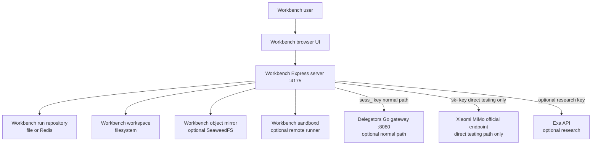

Normal product path:

```text
Workbench browser -> Workbench server -> Delegators gateway -> MiMo
```

Direct testing path:

```text
Workbench browser -> Workbench server -> official MiMo origin
```

The direct testing path exists only for controlled development. `sk-` keys are accepted only when the endpoint origin is `https://api.xiaomimimo.com`.

---

## What Workbench Is

Workbench is a professional artifact builder.

It takes an intent such as:

```text
@ppt create a premium 12-slide team-formation workshop deck
@pdf create an A4 report using current sources
@xlsx turn these notes into a forecast workbook
@resume create an ATS-readable resume from the attached notes
```

Then it:

1. Identifies the artifact skill from the `@` command.
2. Hides the command tag in the frontend while preserving the canonical backend tag.
3. Reads attached references and pasted links.
4. Extracts text/tables/slide text from common file formats.
5. Runs current-source research when the brief needs it.
6. Builds a public user-facing plan and asks clarifying questions when answers materially change the artifact.
7. Calls a Delegators-compatible model endpoint.
8. Allows model tool-calls into a private workspace and optional sandbox.
9. Validates the returned artifact JSON against strict schemas.
10. Performs one repair pass if the JSON is malformed or incomplete.
11. Performs a provider-backed quality inspection and one bounded revision when needed.
12. Exports real PDF, DOCX, PPTX, XLSX, or ZIP files.
13. Renders the artifact in the browser preview panel.

The result is not just chat text. It is a structured artifact plus real downloadable output.

---

## What Workbench Is Not

Workbench is not a replacement for the Delegators SWE coding endpoint.

It does not:

- mint paid sessions;
- own Razorpay or payment success pages;
- replace the Go gateway quota engine;
- replace the server harness prompt pack for coding tools;
- expose provider keys to users;
- turn all provider features into frontend chat logs;
- fabricate fallback documents if the model fails schema validation;
- claim image semantic understanding unless a vision analyzer is configured.

Workbench is a separate product surface that can consume a Delegators session.

---

## Current Pillar Connectivity

Current integration with the four main pillars is deliberately narrow.

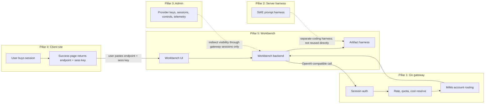

Connected today:

- Workbench can call the Go gateway with a `sess_` key.
- Gateway session auth, plan limits, MiMo account routing, and usage accounting apply when Workbench uses a Delegators endpoint.
- Workbench exposes `/api/config` so the UI can default to a configured Delegators-compatible origin and model.
- Workbench can run separately from admin, client-site, and gateway during local/direct testing.

Not connected today:

- Workbench does not mint sessions.
- Workbench does not write to the main Postgres billing ledger directly.
- Workbench does not use the root SWE prompt pack as-is; it has its own artifact harness prompts.
- Workbench admin controls are not yet first-class in the master admin console.
- Workbench project history is browser-local plus server run repository, not a full user-account product database.

---

## High-Level Architecture

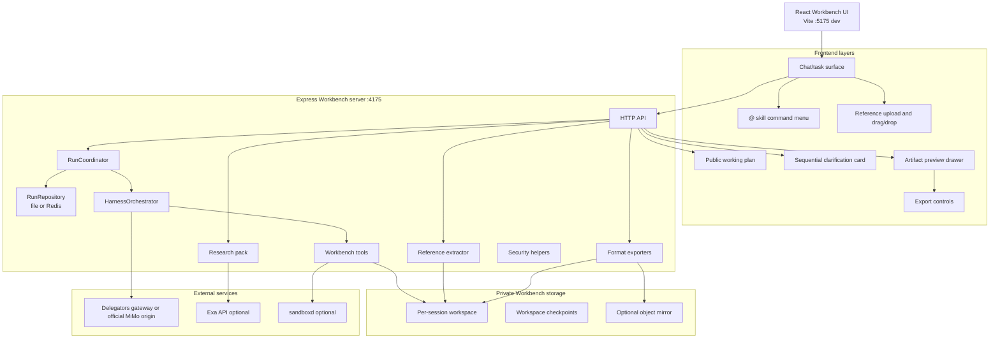

---

## Repository Map

```text
delegators-workbench/
  README.md                     Short operational README
  WORKBENCH_README.md           This technical dossier
  package.json                  Workbench-only Node/React package
  .env.example                  Local runtime settings
  Dockerfile                    Runtime and sandbox-runtime images
  compose.yml                   Production-shaped web/Redis/object-storage topology
  compose.sandbox.dev.yml       Optional local remote sandbox profile

  src/
    App.tsx                     Main Workbench UI, threads, composer, run streaming
    components/ArtifactPreview.tsx
    styles/app.css
    lib/
      shared.ts                 Artifact/run/reference schemas shared by client/server
      skills.ts                 Skill registry and @ command aliases
      skillIcons.ts             Product icon mapping and hidden-tag projection
      commandMenu.ts            @ query detection and selection
      downloads.ts              Browser export/download helpers
      markdown.ts               Artifact-to-markdown rendering
      skillSafety.ts            Skill registry safety checks

  server/
    index.ts                    Express app, routes, generation/refinement pipeline
    runCoordinator.ts           Durable run execution, status, cancel, instructions
    runRepository.ts            File/Redis run and event storage
    harnessOrchestrator.ts      Tool-call loop around the model endpoint
    workbenchTools.ts           Workspace, terminal, web, validation, export tools
    references.ts               Upload/link/reference extraction
    research.ts                 Exa/DuckDuckGo research pack and citation grounding
    workspace.ts                Workspace isolation, limits, cleanup, checkpoints
    sandboxd.ts                 Remote sandbox runner service
    artifactPlan.ts             Fallback plan and clarification logic
    artifactPreflight.ts        Provider-authored public plan parser
    artifactInspection.ts       Quality inspection and bounded revision parser
    artifactRepair.ts           Artifact normalization and internal-leak detection
    exporters.ts                PDF/DOCX/PPTX/XLSX/ZIP exporters
    objectStorage.ts            Optional object mirror
    security.ts                 Endpoint, bind-host, key, and secret-scrubbing guards

  tests/
    *.test.ts                   Unit and integration-style harness tests
```

---

## Frontend Architecture

The frontend is one focused React application. It intentionally feels like a professional agent workspace, but it keeps backend implementation details out of the user-facing transcript.

### UI responsibilities

| UI area | File | Responsibility |
|---|---|---|
| Task shell | `src/App.tsx` | Thread list, active artifact state, settings, run state |
| Composer | `src/App.tsx`, `src/styles/app.css` | Prompt entry, selected skill token, reference chips, drag/drop, submit/cancel |
| Skill command menu | `src/lib/commandMenu.ts`, `src/lib/skills.ts` | Detect `@`, filter skills, insert canonical tag |
| Tool icon presentation | `src/lib/skillIcons.ts` | Show product SVGs while preserving backend tags |
| Plan display | `src/App.tsx` | Show public work plan from server events |
| Clarification card | `src/App.tsx` | Ask one question at a time, collect answers, send as live run instruction |
| Artifact drawer | `src/components/ArtifactPreview.tsx` | Render report/deck/sheet/resume/email previews |
| Export controls | `src/lib/downloads.ts` | Request server export and trigger browser download |

### Composer model

The frontend stores the real prompt with the canonical `@skill` tag:

```text
@ppt create a presentation about forming a team
```

The user sees:

```text
[PowerPoint token] create a presentation about forming a team
```

This allows a clean UI without changing the backend skill trigger.

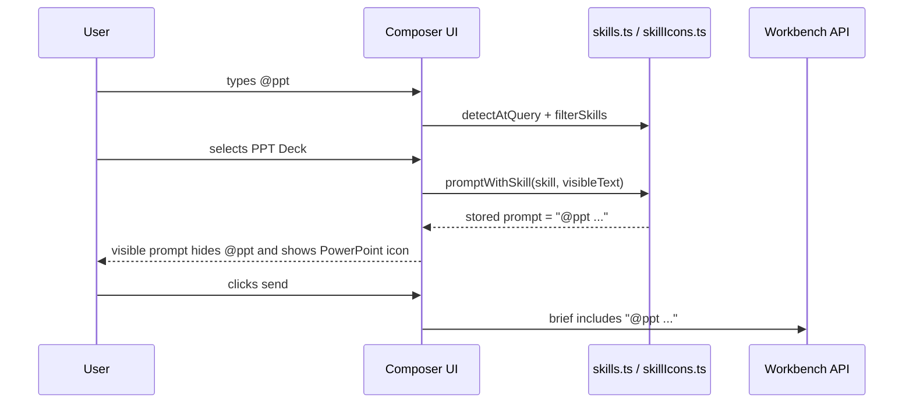

### Reference upload UX

References can enter through:

- paperclip file picker;
- drag/drop directly onto the composer;
- pasted links inside the prompt.

The browser keeps selected file content only in active React state until submit. When a run is launched, the payload includes bounded `references`. The credential-free pending-request snapshot strips references before local persistence.

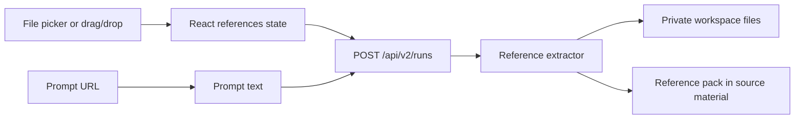

### Thread and recovery state

The browser stores:

- task list;
- messages;
- current artifact versions;
- active thread id;
- endpoint/model settings;
- optional tab-scoped key storage if the user explicitly enables it;
- credential-free pending run data for browser-assisted restart.

The browser does not persist:

- `sessionKey`;
- `researchApiKey`;
- raw uploaded references in pending run snapshots.

---

## Backend Architecture

The backend is an Express server with a run coordinator, repository, artifact generator, tool harness, exporters, and security guards.

### Route groups

| Route | Purpose |
|---|---|
| `GET /api/health`, `GET /healthz` | Health checks |
| `GET /api/config` | Client defaults for Delegators endpoint and model |
| `GET /api/skills` | Data-only skill catalog |
| `POST /api/v2/runs` | Create durable generate/refine run |
| `GET /api/v2/runs/:id` | Get run snapshot |
| `GET /api/v2/runs/:id/events` | Server-sent event stream |
| `POST /api/v2/runs/:id/instructions` | Add mid-run instruction or clarification answers |
| `POST /api/v2/runs/:id/cancel` | Cancel active run |
| `POST /api/agent/artifact` | Legacy synchronous artifact generation |
| `POST /api/agent/refine` | Legacy synchronous refinement |
| `POST /api/agent/search` | Search helper endpoint |
| `POST /api/artifacts/export` | Download export from artifact JSON |

### Backend module flow

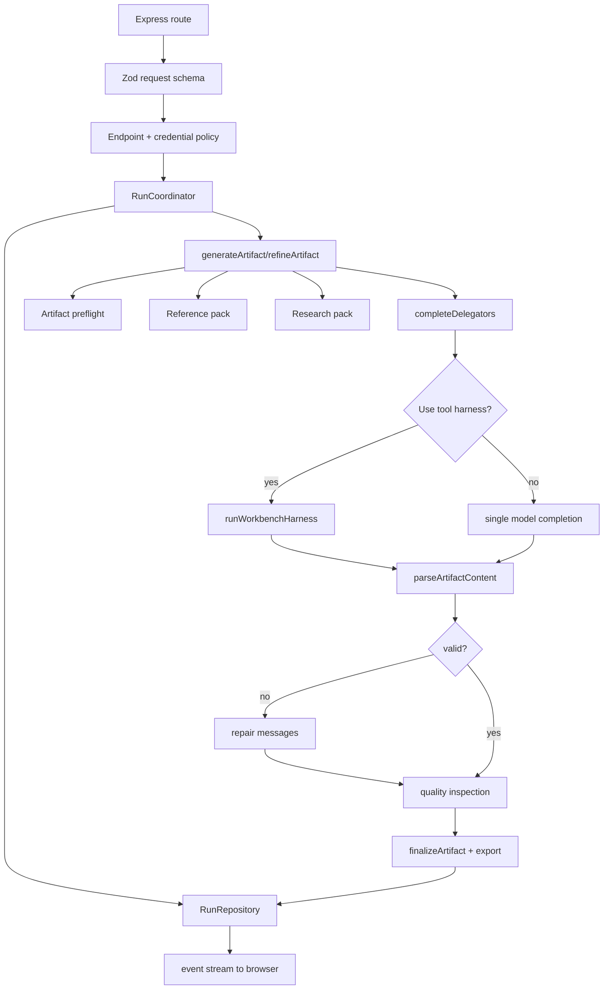

---

## Run Lifecycle

The durable run API exists because artifact creation can take longer than a single HTTP request and may involve questions, tool calls, research, export compilation, or restart recovery.

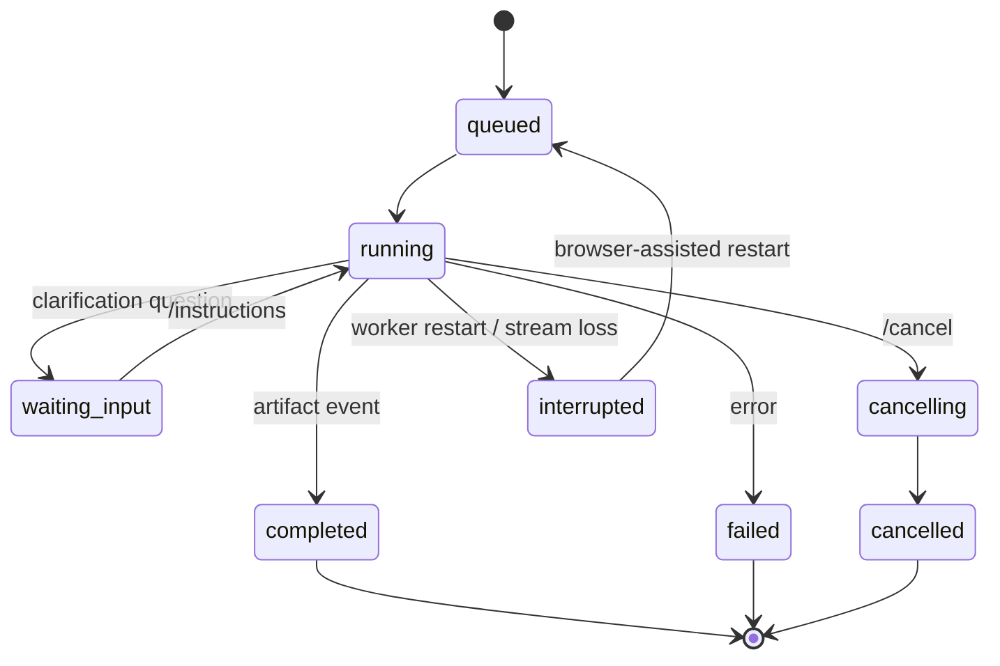

### Execution stages

The run coordinator maps progress events to these server stages:

| Stage | Meaning |
|---|---|
| `intake` | Run created and input accepted |
| `inspect_inputs` | Clarification/input inspection |
| `plan` | Public artifact plan |
| `research` | Search/source retrieval |
| `ground` | Source confidence/citation grounding |
| `outline` | Structure shaping |
| `compose` | Main artifact generation |
| `compile` | Export file preparation |
| `inspect` | Schema and quality inspection |
| `repair` | Artifact repair pass |
| `publish` | Final artifact published |

### Sequence

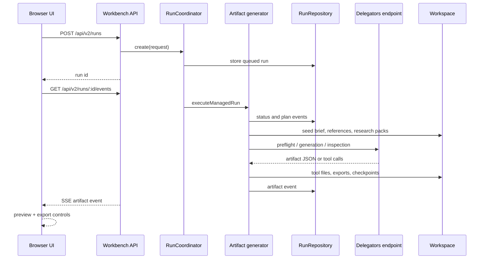

---

## Harness Layers

Workbench uses multiple layers. The layers are intentionally separate because each one catches a different failure mode.

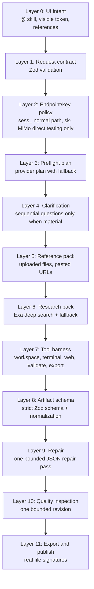

### Layer 0: UI intent

- User chooses a skill via `@`.
- UI shows real product icons.
- Backend still receives canonical `@skill`.
- Attached files and links are associated with the current run.

### Layer 1: request contract

Shared schemas in `src/lib/shared.ts` validate:

- artifact kinds;
- artifact document shape;
- run operation;
- references;
- endpoint and credential shapes;
- progress event shape.

### Layer 2: endpoint/key policy

`server/security.ts` enforces:

- origin-only endpoints;
- production allowlist fail-closed behavior;
- HTTPS in production unless explicitly local;
- link-local/metadata endpoint rejection;
- direct `sk-` credentials only against official Xiaomi MiMo origin;
- secret scrubbing in errors.

### Layer 3: preflight

Workbench asks the provider for a compact user-facing plan. If that fails or produces invalid JSON, it falls back to deterministic local planning.

The preflight prompt forbids internal implementation wording such as backend, harness, terminal, workspace, tool calls, JSON, and schema.

### Layer 4: clarification

Clarification is sequential in the UI. The model or fallback planner may ask multiple questions, but the user sees one at a time and then sends all answers back as one run instruction.

### Layer 5: reference pack

`server/references.ts` turns uploaded files and prompt URLs into a bounded Markdown and JSON source pack, then seeds both extracted content and original upload bytes into the private workspace. Office documents use the private MarkItDown sidecar first and fall back to built-in PDF/OOXML/XLSX extractors.

### Layer 6: research pack

`server/research.ts` detects current-source prompts and builds a source pack using Exa deep search when configured, with DuckDuckGo fallback. For visual reports and decks, it first discovers bounded Open Graph images from verified source pages. If slots remain, it searches Wikimedia Commons for bitmap media and retains the Commons source page plus license credit. Every image still passes SSRF-safe fetch, MIME, byte-size, and dimension validation.

### Layer 6a: active artifact skill

`server/artifactSkills.ts` builds a request-specific format skill and publication checklist. Both are included in the trusted generation instructions and seeded as `skills/active/SKILL.md` plus `skills/active/quality-checklist.md` so the same rules remain available inside the tool harness.

### Layer 7: tool harness

`server/harnessOrchestrator.ts` loops through provider tool calls until the model returns artifact JSON or tool budget is exhausted.

### Layer 8: artifact schema

`ArtifactDocumentSchema` requires exportable, structured content. Decks need slides. Sheets need workbook data or tables. Resumes need structured resume data.

### Layer 9: repair

If the model returns invalid artifact JSON, Workbench asks for one repair using only already-present facts and the original brief.

### Layer 10: quality inspection

Deterministic local publication checks run alongside the provider inspection. The local evaluator catches objective failures even when provider inspection is unavailable: ignored slide counts or formats, empty non-template workbooks, overloaded or single-layout decks, missing requested design metadata, and trivially shallow documents that were explicitly requested as comprehensive. Provider feedback adds higher-level taste and brief fidelity. If either evaluator finds a fixable issue, Workbench performs one bounded revision and reruns the local publication checks before export.

### Layer 11: export and publish

`server/exporters.ts` compiles real files and validates signatures:

- PDF starts with `%PDF-`;
- DOCX/PPTX/XLSX are valid OOXML zip containers with required entries;
- ZIP contains generated artifact materials.

---

## Research Layer

Research is triggered by prompt terms such as latest, current, recent, research, news, launched, market, statistic, citations, pricing, project, and report on.

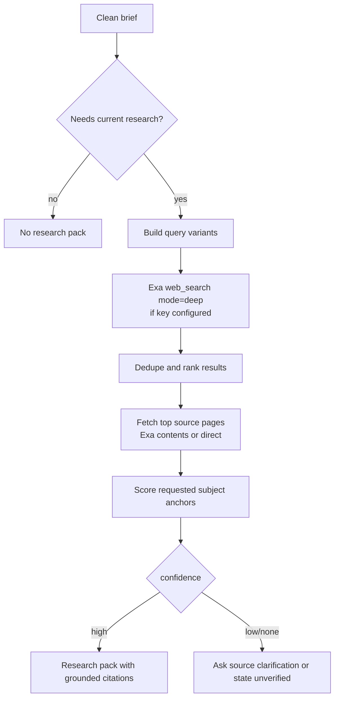

Research safeguards:

- citations must match captured URLs;
- low-confidence subjects must be explicitly described as unverified;
- Workbench must not substitute a generic company profile when a named project cannot be verified;
- direct user-provided URLs are treated as source candidates but still fetched through SSRF guards.

---

## Reference Upload Layer

Reference intake supports common day-to-day office/corporate inputs.

| Reference type | Current behavior |
|---|---|
| Pasted URL | Fetched through `webFetch`; Exa contents when key exists |
| TXT/MD/CSV/TSV/JSON | UTF-8 text extraction |
| PDF | `pdf-parse` text extraction |
| DOCX | ZIP XML text extraction from Word document/header/footer XML |
| PPTX | ZIP XML slide text extraction |
| XLSX | `exceljs` workbook and row extraction |
| PNG/JPG/GIF/WebP | Native Workbench semantic vision analysis; self-hosted vision or local Tesseract OCR fallback |

Important finding: Workbench must not pretend that OCR is semantic image understanding. The production-safe shape is:

```text
upload -> private workspace -> server extraction -> bounded reference pack -> grounded analysis -> artifact plan
```

For images, the system first calls the wallet-entitled native Workbench vision analyzer through the original
Delegators artifact harness. A configured `WORKBENCH_VISION_BASE_URL` and local Tesseract OCR are
fallbacks. OCR results carry an explicit warning that non-text visual details were not analyzed.

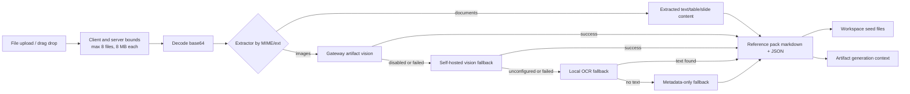

---

## Workspace And Storage Layer

Every run gets a private workspace rooted under `WORKBENCH_STORAGE_ROOT` or `/tmp/delegators-workbench`.

Workspace id shape:

```text
<storage-root>/<session-hash>/<thread-or-random-workspace-id>/
```

The session key is never used as a path. It is SHA-256 hashed and truncated for workspace partitioning.

Workspace limits:

| Limit | Current default |
|---|---:|
| Max file bytes | 25 MB |
| Max total bytes | 200 MB |
| Max files | 500 |
| TTL | 30 days |
| Cleanup interval | 30 minutes |

Workspace operations:

- safe relative path resolution;
- path traversal rejection;
- null-byte rejection;
- binary/text writes;
- text reads with max byte caps;
- workspace listing with SHA-256 hashes;
- checkpoints before risky tool writes/deletes/terminal runs;
- TTL cleanup.

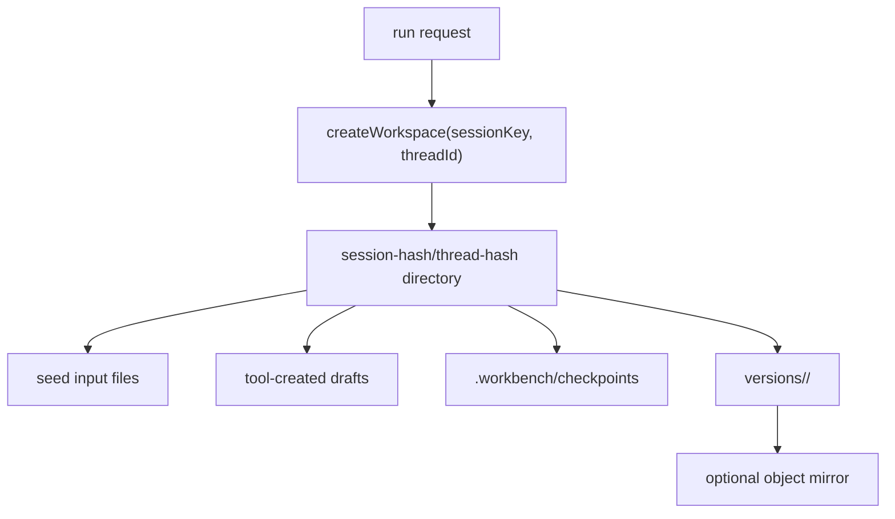

Object storage:

- optional `WORKBENCH_OBJECT_STORAGE_URL`;
- current compose uses SeaweedFS mini;
- credentialed deployments use SigV4-signed S3-compatible `PUT` requests, including Cloudflare R2;
- exports are mirrored under `runs/<workspace-id>/versions/<version-id>/<file>`.

---

## Terminal And Sandbox Layer

The terminal is a Workbench tool, not a frontend console. The user should not see backend logs. The model can request bounded scripts only when it materially improves artifact creation.

Supported runtimes:

- `python3`;
- `node`;
- `bash`.

Modes:

| Mode | Meaning |
|---|---|
| `off` | Terminal disabled |
| `local` | Runs locally; blocked in production unless explicitly unsafe |
| `docker` | Runs in local Docker container with network disabled |
| `remote` | Calls `sandboxd` service |

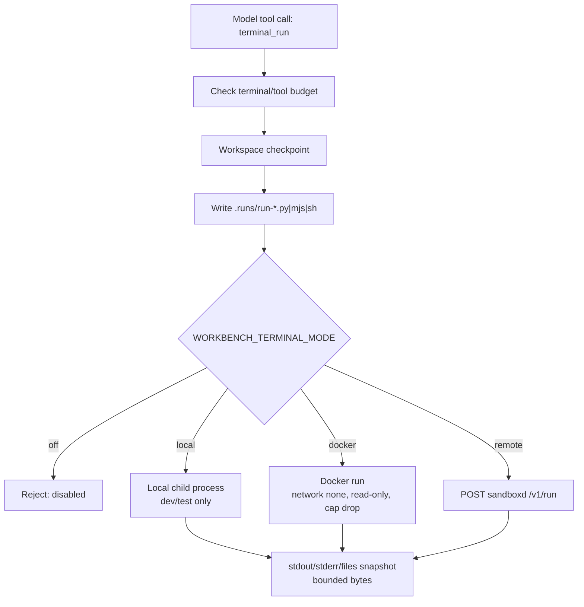

Remote sandbox profile:

- `web` has no Docker socket;
- `sandboxd` runs on internal network;
- the default Compose stack mounts the shared workspace as a named-volume subpath, so each runtime
  sees only the requesting thread workspace;
- runtime containers are disposable, networkless, read-only, resource-limited, capability-dropped,
  and receive no Workbench or provider credentials;
- the local Compose sandbox uses the host Docker socket; the optional development overlay can use
  rootless Docker-in-Docker instead;
- production should point at a dedicated rootless Docker or gVisor host over TLS.

---

## Artifact Schema Layer

All artifacts share a common structure:

```text
{
  kind,
  primaryFormat,
  title,
  audience,
  tone,
  executiveSummary,
  design,
  sections,
  slides?,
  resume?,
  sheet?,
  citations?,
  nextQuestions?
}
```

Artifact kinds:

| Kind | Primary uses | Required structured data |
|---|---|---|
| `resume` | Resume, cover letter style career artifacts | `resume` object |
| `deck` | PPT decks | `slides` array |
| `report` | PDF/Word reports, proposals, project reports | sections |
| `assignment` | College/academic drafts | sections |
| `email` | Office mail/memo/reply | sections |
| `sheet` | Excel workbooks | `sheet.sheets` or real tables |

Design metadata:

- visual direction;
- heading font;
- body font;
- page size;
- orientation;
- slide aspect;
- density;
- table of contents;
- page numbers;
- section numbers;
- palette.

The schema rejects:

- unresolved placeholders;
- missing slides for deck output;
- missing sheet data for spreadsheet output;
- missing resume structure for resume output;
- unsupported primary format combinations.

---

## Export Layer

Export formats:

| Format | Library/path | Notes |
|---|---|---|
| PDF | `jspdf` | Reports and deck PDF export |
| DOCX | `docx` | Editable documents, resumes, reports |
| PPTX | `pptxgenjs` | PowerPoint-ready decks |
| XLSX | `exceljs` | Workbook sheets and tabular artifacts |
| ZIP | `jszip` | Bundle of artifact outputs/source |

Export validation:

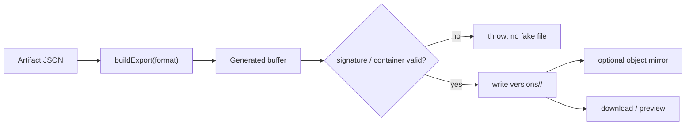

The export layer is deliberately strict. If an export is malformed, Workbench fails the run instead of giving the user a fake file.

---

## Preview Layer

The frontend preview renders artifacts from structured JSON. It does not render model-provided HTML.

Preview modes:

- report/document sections;
- resume profile;
- deck slides;
- email body;
- workbook tables;
- citations tab.

Security property: artifact text is rendered through React text nodes/components, not injected as raw HTML.

---

## Security Model

### Credential handling

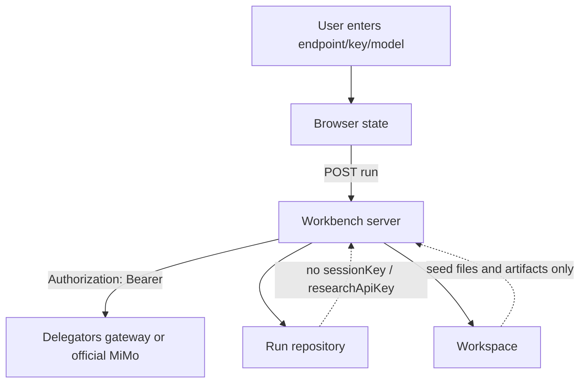

Rules:

- server never persists `sessionKey`;
- browser only persists tab key if user enables tab storage;
- pending browser recovery data strips credentials and references;
- direct `sk-` keys only work with official MiMo origin;
- upstream error bodies are scrubbed before surfacing;
- production app auth is required unless explicitly unsafe override is set.

### Endpoint policy

`resolveDelegatorsBaseURL` enforces:

- URL must be origin only;
- no username/password;
- no query/hash;
- no path beyond `/`;
- no link-local or metadata targets;
- production requires allowlist unless local override is explicit;
- production requires HTTPS unless local override is explicit.

### Network and runtime policy

Production compose:

- Workbench exposed only on `127.0.0.1:<host-port>`;
- internal Redis and object storage on private `core` network;
- `web` container is read-only;
- `/tmp` is tmpfs;
- capabilities dropped;
- `no-new-privileges`;
- Workbench auth token required.

Sandbox policy:

- Compose enables authenticated remote terminal mode by default;
- production local terminal execution blocked unless explicitly unsafe;
- docker mode uses `--network=none`, read-only container, memory/CPU/PID limits, dropped capabilities;
- remote mode isolates execution behind `sandboxd`.

### Web fetch policy

`webFetch` rejects:

- non-HTTP(S) URLs;
- localhost;
- `.local`;
- cloud metadata hostnames;
- private, link-local, loopback, unspecified IPs;
- DNS results resolving to blocked IPs;
- unsupported content types for direct fetch.

---

## Production Topology

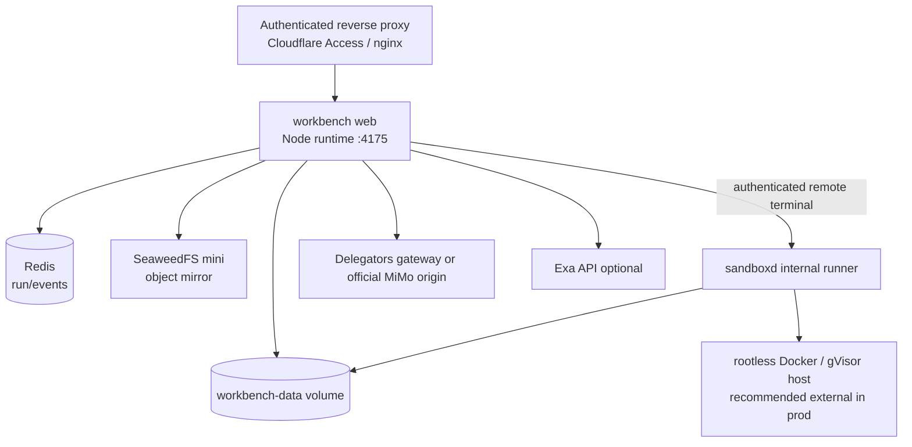

The compose file uses:

- `web`;
- `redis`;
- `object-storage`;
- `sandbox` plus a shared workspace volume;
- optional rootless Docker-in-Docker overlay for local development.

Production notes:

- put authenticated proxy in front;
- keep `WORKBENCH_AUTH_TOKEN` set;
- replace the default `WORKBENCH_SANDBOX_TOKEN` with a separate random secret;
- set `WORKBENCH_ALLOWED_DELEGATORS_ORIGINS`;
- use a dedicated sandbox host rather than the host Docker socket for internet-facing production;
- use Redis for durable event replay across process restarts;
- configure object storage if exported files need durable external access.

---

## Current Features

### User-facing artifact features

- `@` skill command menu;
- product SVG icons for PowerPoint, PDF, Word, Gmail, Excel, resume, and generic artifacts;
- hidden canonical `@skill` backend tag;
- professional selected-tool composer token;
- drag/drop file references;
- paperclip file references;
- prompt URL references;
- live public working plan;
- sequential clarification card;
- mid-run instruction injection;
- cancel active run;
- resume interrupted runs with current tab credentials;
- artifact preview drawer;
- version selection;
- citations tab;
- PDF/DOCX/PPTX/XLSX/ZIP exports.

### Supported skills

| Skill id | Tags | Kind | Primary output |
|---|---|---|---|
| `ppt` | `@ppt`, `@slides`, `@deck`, `@presentation` | `deck` | `pptx` |
| `pdf` | `@pdf`, `@report`, `@writeup` | `report` | `pdf` |
| `word` | `@word`, `@docx`, `@document`, `@doc` | `report` | `docx` |
| `resume` | `@resume`, `@cv`, `@ats` | `resume` | `docx` |
| `cover-letter` | `@coverletter`, `@cover`, `@letter` | `resume` | `docx` |
| `assignment` | `@assignment`, `@homework`, `@school`, `@college` | `assignment` | `docx` |
| `project` | `@project`, `@synopsis`, `@minorproject`, `@majorproject` | `report` | `pdf` |
| `email` | `@email`, `@mail`, `@memo`, `@reply` | `email` | `docx` |
| `xlsx` | `@xlsx`, `@excel`, `@sheet`, `@spreadsheet`, `@csv` | `sheet` | `xlsx` |
| `proposal` | `@proposal`, `@pitch`, `@brief` | `report` | `docx` |
| `sop` | `@sop`, `@statement`, `@lor` | `report` | `docx` |

### Backend harness features

- durable run state;
- SSE replay;
- cancellation;
- browser-assisted restart;
- file or Redis repository;
- per-IP fixed-window rate limit;
- strict request schemas;
- provider preflight;
- fallback preflight;
- Exa deep search and DuckDuckGo fallback;
- citation grounding;
- reference extraction;
- private workspace;
- tool budgets per model tier;
- workspace file tools;
- terminal tools;
- web fetch/search tools;
- artifact validation tool;
- artifact export tool;
- schema normalization;
- placeholder rejection;
- internal execution leak rejection;
- one repair pass;
- one quality revision pass;
- export validation;
- object mirror.

---

## What We Built In This Workbench Pass

This section records the practical work completed so far in this thread.

### 1. Workbench artifact pipeline

Added or hardened:

- durable `/api/v2/runs`;
- run repository;
- SSE reconnect/replay;
- run cancellation;
- browser-assisted restart;
- mid-run instructions;
- provider/fallback preflight;
- sequential clarification UI;
- artifact plan display;
- quality inspection;
- repair flow;
- export validation.

### 2. Artifact schema and exports

Added or hardened:

- structured Zod artifact schema;
- design metadata;
- deck slide support;
- sheet workbook support;
- resume structured data;
- placeholder rejection;
- JSON normalization;
- PDF/DOCX/PPTX/XLSX/ZIP exporters;
- native preview rendering.

### 3. Research and grounding

Added or hardened:

- research trigger detection;
- multi-query research;
- Exa deep search mode;
- DuckDuckGo fallback;
- source fetching;
- citation URL grounding;
- low-confidence unverified-topic behavior;
- explicit prevention of substituting unrelated public facts.

### 4. Reference intake

Added:

- shared reference schema;
- drag/drop upload in composer;
- paperclip upload in composer;
- prompt URL extraction;
- PDF text extraction;
- DOCX text extraction;
- PPTX slide text extraction;
- XLSX row extraction;
- text/CSV/JSON extraction;
- self-hosted image vision, local OCR fallback, and metadata-only final fallback with no fake semantic claims;
- private workspace seeding for raw uploads and extracted text.

### 5. UI/UX

Added or improved:

- product SVG icons;
- `resume.svg` for resume;
- `others.svg` for generic artifacts;
- hidden `@skill` prefix in composer;
- selected skill token;
- attachment chips;
- drag/drop composer overlay;
- responsive checks for desktop/mobile.

### 6. Security and operational shape

Added or hardened:

- production auth startup guard;
- endpoint allowlist behavior;
- official MiMo origin policy for direct keys;
- link-local/metadata endpoint block;
- SSRF guard for web fetch;
- no raw uploaded references in local pending recovery snapshots;
- Docker compose with Redis and object storage;
- optional sandbox profile.

---

## Validation Evidence

Latest local verification performed after the current Workbench changes:

```text
npm run typecheck
npm test -- --run
npm run build
browser drag/drop smoke test
```

Observed results:

```text
Typecheck: clean
Vitest: 100 passed, 1 skipped
Build: clean Vite production build
Browser smoke: dropped drag-reference.txt, chip appeared, drag highlight cleared
```

Root current-state report evidence from `README_CURRENT_STATE_2026-06-08.md`:

- Workbench backend score: 8.1.
- Workbench frontend score: 8.0.
- Workbench generated and exported all supported artifact kinds through all four Delegators plans.
- Workbench full matrix: 24/24 plan-by-artifact generations and 24/24 real file exports.
- Browser checks covered desktop/mobile behavior.

Security validation called out in current-state material:

- metadata/link-local Workbench endpoint was blocked;
- unsafe rendered artifact text did not execute as HTML/JS;
- endpoint and production auth controls exist;
- schema repair and placeholder rejection were tested.

---

## Current Findings

### Finding 1: Workbench is now a real product surface

It is no longer just a frontend mock. It has backend run state, structured artifacts, exports, previews, research, references, and a tool harness.

### Finding 2: The correct provider shape is MiMo through the Delegators contract

The normal production path should remain:

```text
Workbench -> Delegators gateway -> MiMo
```

Direct MiMo `sk-` testing remains useful for controlled development, but public product users should use `sess_` keys through the Delegators endpoint.

### Finding 3: File understanding should be harness-owned

Workbench should not rely on the provider magically understanding every uploaded binary. The safer and more controllable architecture is:

```text
upload -> extractor -> reference pack -> workspace -> model context
```

This is now implemented for common office formats.

### Finding 4: Vision is native and layered

Uploaded images first use the native Workbench vision analyzer through the Delegators artifact harness, then self-hosted vision or local Tesseract OCR, and finally an explicit metadata-only result. PNG/JPEG uploads can also be reused as attributed artifact assets.

### Finding 5: The Workbench harness is separate from the SWE harness

The SWE harness optimizes coding sessions. The Workbench harness optimizes artifact creation. They share the OpenAI-compatible endpoint contract but have different prompt layers, schemas, and quality gates.

### Finding 6: Research is useful but not proof by itself

Exa deep search improves current-source retrieval. The artifact still needs citation grounding and low-confidence behavior. Those checks now exist, but research quality must be measured on real production prompts.

---

## Known Limits

Current limits:

- no first-class Workbench account/project database;
- browser task history is durable in IndexedDB with a compact localStorage startup fallback, but it is not a shared collaborative workspace;
- no admin-panel controls dedicated to Workbench yet;
- Workbench rate limiter is in-memory per instance;
- semantic image understanding requires a configured self-hosted vision model; default local OCR is text-only;
- no large corpus automated artifact quality benchmark yet;
- no public Workbench pricing model finalized;
- no standalone uploaded-file asset library in UI outside its thread/workspace;
- no full audit trail surfaced to admin;
- direct provider testing is not a production user path.

Operational cautions:

- keep `WORKBENCH_AUTH_TOKEN` set in production;
- do not expose Workbench publicly without authenticated proxy;
- set endpoint allowlist in production;
- replace the local Docker-socket sandbox with a dedicated hardened runner for public production;
- do not store provider keys in code;
- use `sess_` keys for product path.

---

## Recommended Next Work

### Product

1. Decide whether Workbench is sold as:
   - included with existing SWE sessions;
   - separate artifact plans;
   - cheap daily office packs;
   - premium research/report packs.
2. Define Workbench-specific quotas:
   - runs per day;
   - artifacts per session;
   - max upload bytes;
   - max Exa searches;
   - max terminal runs;
   - max output files.
3. Add a Workbench project/account layer if this becomes a customer-facing suite product.

### Harness

1. Add artifact-specific evaluators for:
   - deck quality;
   - report citation quality;
   - spreadsheet formula correctness;
   - resume truthfulness and ATS formatting.
2. Expand reference extraction to:
   - legacy `.doc`, `.ppt`, `.xls` if required.
3. Add budget telemetry per Workbench run.

### Infra

1. Move rate limiting to Redis for multi-replica Workbench deployments.
2. Add Workbench metrics:
   - run latency;
   - model call count;
   - tool call count;
   - Exa call count;
   - repair rate;
   - quality revision rate;
   - export failure rate.
3. Add admin-panel view for Workbench runs and artifact economics.
4. Add production sandbox host separate from the web container.

### UX

1. Add visible reference manager.
2. Add per-reference extraction status.
3. Add source confidence indicator in artifact drawer.
4. Add export history/version downloads.
5. Add artifact templates without hardcoding output style against user prompts.

---

## Current Bottom Line

Delegators Workbench is now a standalone artifact-generation pillar with a real backend harness. It is connected to the main Delegators business through the same endpoint/session-key contract, but it does not yet share the full admin, billing, project, or account-management surface.

The current architecture is correct for the next phase:

```text
simple professional UI
+ structured artifact schema
+ private workspace
+ Exa research
+ file/link reference extraction
+ bounded tool harness
+ real exporters
+ strict security gates
```

The most important next gap is not another generic chat feature. It is measured artifact quality: real workloads, real plan economics, real reference/vision evaluation, and Workbench-specific pricing limits.
